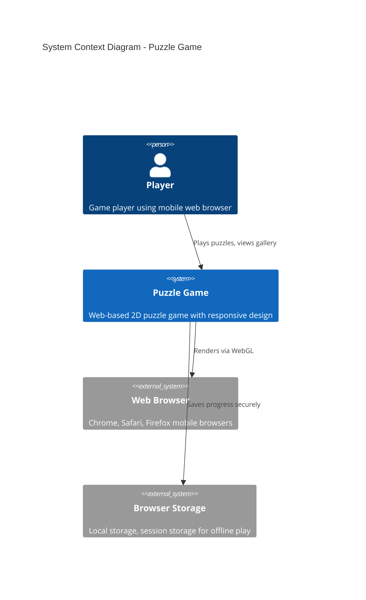
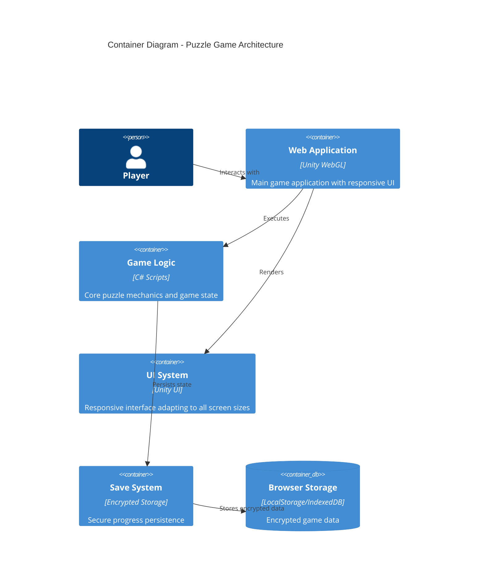
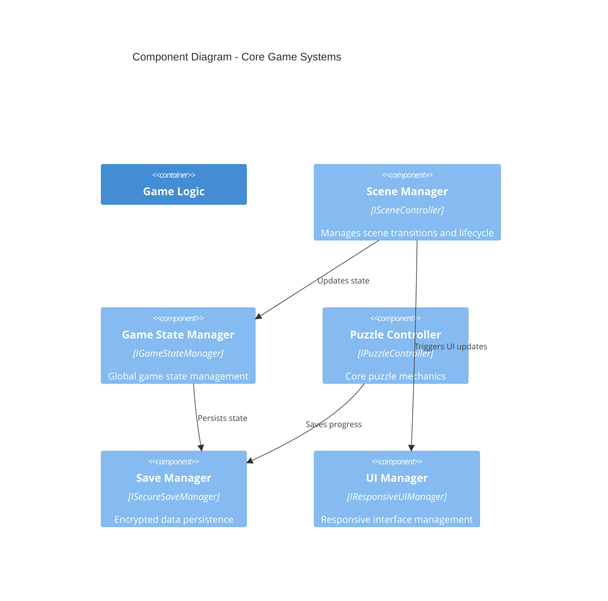
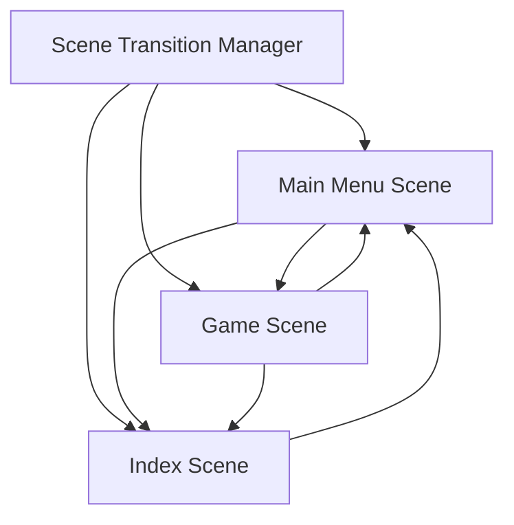
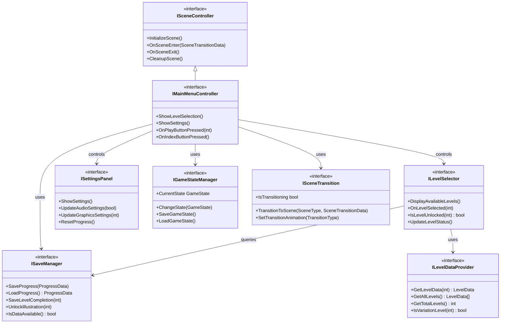
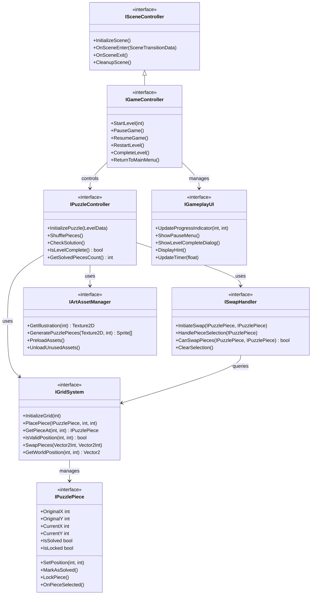
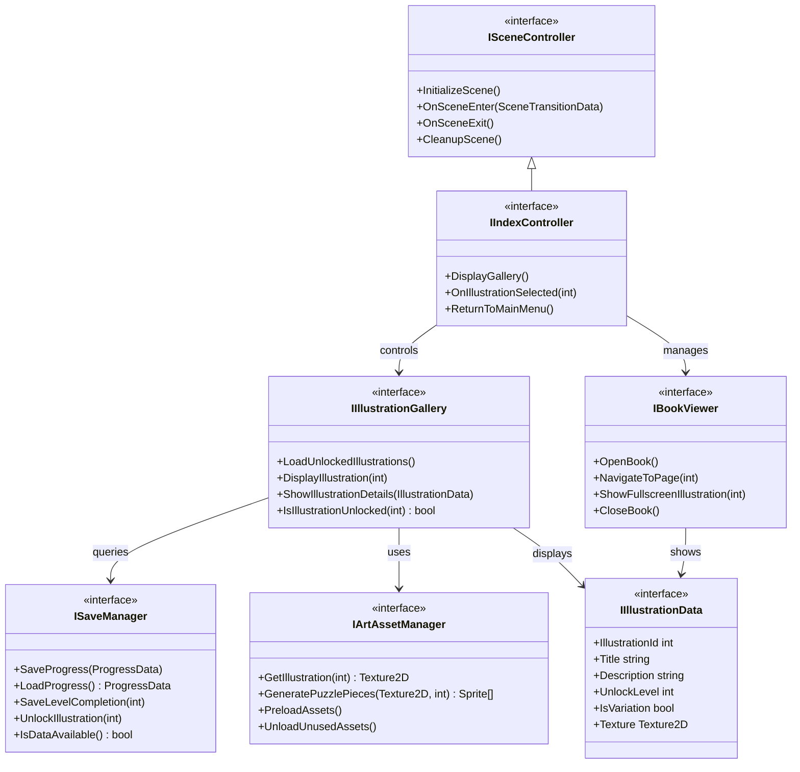

# Puzzle Game - Software Development Plan


## Technical Architecture

### C4 Context Diagram - System Overview



### C4 Container Diagram - System Architecture



### C4 Component Diagram - Core Game Components



### Scene Architecture Overview



## Scene-Specific Architecture

### Main Menu Scene - Interface Architecture



### Game Scene - Interface Architecture



### Index Scene - Interface Architecture



## Core Technical Components & Interfaces

### Scene Controller Interfaces

```csharp
public interface ISceneController
{
    void InitializeScene();
    void OnSceneEnter(SceneTransitionData data);
    void OnSceneExit();
    void CleanupScene();
}
```

```csharp
public interface ISceneTransition
{
    void TransitionToScene(SceneType targetScene, SceneTransitionData data = null);
    void SetTransitionAnimation(TransitionType type);
    bool IsTransitioning { get; }
}
```

### Main Menu Scene Interfaces

```csharp
public interface IMainMenuController : ISceneController
{
    void ShowLevelSelection();
    void ShowSettings();
    void OnPlayButtonPressed(int levelId);
    void OnIndexButtonPressed();
}
```

```csharp
public interface ILevelSelector
{
    void DisplayAvailableLevels();
    void OnLevelSelected(int levelId);
    bool IsLevelUnlocked(int levelId);
    void UpdateLevelStatus();
}
```

### Game Scene Interfaces

```csharp
public interface IGameController : ISceneController
{
    void StartLevel(int levelId);
    void PauseGame();
    void ResumeGame();
    void RestartLevel();
    void CompleteLevel();
    void ReturnToMainMenu();
}
```

```csharp
public interface IPuzzleController
{
    void InitializePuzzle(LevelData levelData);
    void ShufflePieces();
    void CheckSolution();
    bool IsLevelComplete();
    int GetSolvedPiecesCount();
}
```

```csharp
public interface IPuzzlePiece
{
    int OriginalX { get; }
    int OriginalY { get; }
    int CurrentX { get; set; }
    int CurrentY { get; set; }
    bool IsSolved { get; }
    bool IsLocked { get; }
    
    void SetPosition(int x, int y);
    void MarkAsSolved();
    void LockPiece();
    void OnPieceSelected();
}
```

```csharp
public interface IGridSystem
{
    void InitializeGrid(int size);
    void PlacePiece(IPuzzlePiece piece, int x, int y);
    IPuzzlePiece GetPieceAt(int x, int y);
    bool IsValidPosition(int x, int y);
    void SwapPieces(Vector2Int pos1, Vector2Int pos2);
    Vector2 GetWorldPosition(int x, int y);
}
```

```csharp
public interface ISwapHandler
{
    void InitiateSwap(IPuzzlePiece piece1, IPuzzlePiece piece2);
    void HandlePieceSelection(IPuzzlePiece selectedPiece);
    bool CanSwapPieces(IPuzzlePiece piece1, IPuzzlePiece piece2);
    void ClearSelection();
}
```

### Index Scene Interfaces

```csharp
public interface IIndexController : ISceneController
{
    void DisplayGallery();
    void OnIllustrationSelected(int illustrationId);
    void ReturnToMainMenu();
}
```

```csharp
public interface IIllustrationGallery
{
    void LoadUnlockedIllustrations();
    void DisplayIllustration(int illustrationId);
    void ShowIllustrationDetails(IllustrationData data);
    bool IsIllustrationUnlocked(int illustrationId);
}
```

### Core System Interfaces

```csharp
public interface IGameStateManager
{
    GameState CurrentState { get; }
    void ChangeState(GameState newState);
    void SaveGameState();
    void LoadGameState();
}
```

```csharp
public interface ISaveManager
{
    void SaveProgress(ProgressData data);
    ProgressData LoadProgress();
    void SaveLevelCompletion(int levelId);
    void UnlockIllustration(int illustrationId);
    bool IsDataAvailable();
}
```

```csharp
public interface ILevelDataProvider
{
    LevelData GetLevelData(int levelId);
    LevelData[] GetAllLevels();
    int GetTotalLevels();
    bool IsVariationLevel(int levelId);
}
```

```csharp
public interface IArtAssetManager
{
    Texture2D GetIllustration(int illustrationId);
    Sprite[] GeneratePuzzlePieces(Texture2D illustration, int gridSize);
    void PreloadAssets();
    void UnloadUnusedAssets();
}
```

### Data Structures

```csharp
public interface ILevelData
{
    int LevelId { get; }
    Texture2D Illustration { get; }
    int GridSize { get; }
    int PreSolvedPieces { get; }
    bool IsVariation { get; }
    int BaseLevel { get; }
    string LevelName { get; }
}
```

```csharp
public interface IProgressData
{
    int CurrentLevel { get; set; }
    bool[] UnlockedLevels { get; set; }
    bool[] UnlockedIllustrations { get; set; }
    DateTime LastPlayTime { get; set; }
}
```

```csharp
public interface ISceneTransitionData
{
    SceneType SourceScene { get; }
    SceneType TargetScene { get; }
    Dictionary<string, object> Parameters { get; }
}
```

### Enums

```csharp
public enum SceneType
{
    MainMenu,
    Game,
    Index
}

public enum GameState
{
    MainMenu,
    Playing,
    Paused,
    LevelComplete,
    ViewingGallery
}

public enum TransitionType
{
    Fade,
    Slide,
    Instant
}
```


## Technical Specifications

### Performance Requirements
- **Target FPS:** 60fps on mid-range mobile devices
- **Memory Usage:** <100MB RAM usage
- **Build Size:** <20MB WebGL build
- **Load Time:** <5 seconds initial load on 3G connection

### Responsive Design Specifications
- **Minimum Resolution:** 320×568 (iPhone SE)
- **Maximum Resolution:** 1920×1080 (Desktop)
- **Aspect Ratios:** Support 16:9, 4:3, 18:9, 19.5:9
- **Touch Targets:** Minimum 44×44 pixels for mobile interaction

### Browser Compatibility
- **Primary:** Chrome Mobile, Safari Mobile
- **Secondary:** Firefox Mobile, Edge Mobile
- **WebGL Support:** WebGL 2.0 preferred, WebGL 1.0 fallback

## Asset Requirements & Specifications

### Art Asset Specifications
- **Illustration Format:** PNG, minimum 1024×1024 resolution
- **Compression:** Unity's default texture compression for WebGL
- **Naming Convention:** `level_XX_illustration.png`, `level_XX_var_illustration.png`

### Audio (if needed)
- **Format:** Compressed audio (OGG for web)
- **Usage:** UI feedback sounds, completion sounds
- **Size Limit:** <1MB total audio assets

## Risk Assessment & Mitigation

### Technical Risks
1. **WebGL Performance on Low-end Devices**
   - *Mitigation:* Early performance testing, scalable quality settings

2. **Touch Input Precision on Small Screens**
   - *Mitigation:* Generous touch areas, visual feedback for selections

3. **Browser Compatibility Issues**
   - *Mitigation:* Regular testing across target browsers

### Content Risks
1. **Art Asset Delivery Timeline**
   - *Mitigation:* Use placeholder assets, establish clear delivery schedule

2. **Scope Creep**
   - *Mitigation:* Clear feature lockdown after Phase 2

## Testing Strategy

### Functional Testing
- Puzzle solution validation across all grid sizes
- Save/load functionality
- Level progression and unlocking
- Cross-browser compatibility

### Performance Testing
- Frame rate testing on target devices
- Memory usage profiling
- Load time optimization
- Battery usage impact

### User Experience Testing
- Mobile touch interaction testing
- Responsive design validation
- Accessibility considerations (minimum touch targets)

## Deployment Plan

### Build Configuration
- Unity WebGL build with compression enabled
- Brotli compression for smaller download size
- Progressive web app considerations (optional)

### Hosting Requirements
- Static file hosting (can use GitHub Pages, Netlify, etc.)
- HTTPS required for modern browser features
- CDN recommended for global access

## Success Metrics

### Technical Metrics
- <5 second load time on 3G
- >30 FPS on mid-range mobile devices
- <5% crash rate across supported browsers
- 100% offline functionality after initial load

### Gameplay Metrics
- Puzzle completion rate >80% for early levels
- Average session time >10 minutes
- Level progression rate (analytics for future improvements)

## Future Considerations (Post-MVP)

### Potential Enhancements
- Hint system for difficult puzzles
- Timer-based scoring system
- Additional puzzle variations (rotation, mirroring)
- Social sharing of completed illustrations
- Progressive Web App (PWA) features

### Technical Debt Management
- Code documentation and architecture review
- Performance optimization opportunities
- Scalability considerations for additional content

---

*This document serves as the primary technical specification for the puzzle game development project. All implementation details should reference this plan, and any significant changes should be documented and approved.*